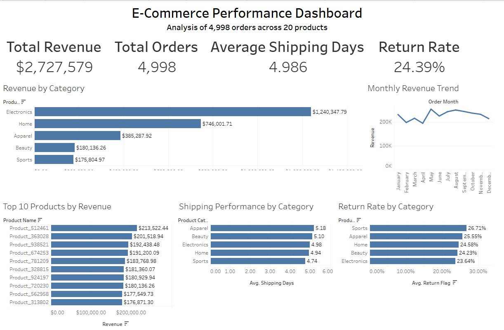

# E-Commerce Orders & Product Performance Analysis

## 📊 Project Overview
This project analyzes 4,998 customer orders across 20 products to evaluate revenue performance, return rates, shipping efficiency, and product performance.

## 🎯 Business Problem
A retail business needs insights into:
- Top-performing products and categories
- Return behavior and potential issues
- Shipping efficiency
- Products with no sales activity

## 🛠 Tools Used
- SQL (data extraction and analysis)
- Python (pandas, matplotlib for analysis and feature engineering)
- Tableau (interactive dashboard)
- GitHub (project documentation)

## 📁 Dataset
- Orders table: 4,998 rows
- Products table: 20 products
- Includes realistic variation in pricing, discounts, and order behavior

## 🔍 Key Analysis Performed
- Revenue analysis by product and category
- Return rate analysis using CASE logic
- Shipping performance analysis
- Profit estimation
- Identification of products with no orders

## 📈 Key Insights
- Revenue is concentrated among a small number of products
- Certain categories have higher return rates
- Shipping time varies across product categories
- Several products have no sales activity

## 📊 Dashboard

https://public.tableau.com/app/profile/wyatt.chesser/viz/E-CommercePerformanceProject/E-CommercePerformanceDashboard#1

## 📂 Files Included
- SQL queries (`ecommerce_analysis.sql`)
- Python notebook (`ecommerce_analysis.ipynb`)
- Cleaned dataset (`ecommerce_cleaned.csv`)
- Raw datasets
- Dashboard screenshot
  

## 👤 Author
Wyatt Chesser
